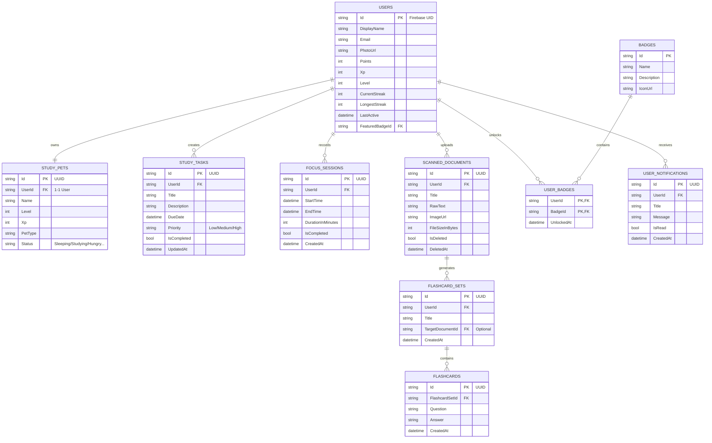

# Tài liệu Tổng quan Kiến trúc và Tính năng Hệ sinh thái StudyFlow

Dự án **StudyFlow** là một hệ sinh thái quản lý học tập và nâng cao năng suất toàn diện dành cho học sinh, sinh viên. Tài liệu này cung cấp cái nhìn chi tiết về kiến trúc hệ thống, các công nghệ sử dụng, thiết kế phần mềm, mô hình thực thể cơ sở dữ liệu và cơ chế hoạt động của từng tính năng cốt lõi trong hệ thống.

---

## 1. Kiến trúc Hệ thống & Mô hình Hoạt động (Architecture)

StudyFlow được thiết kế theo mô hình **Client-Server** kết hợp lưu trữ lai **Hybrid Database (Offline-First)** để tối ưu hóa hiệu năng, tính sẵn sàng cao và khả năng làm việc ngoại tuyến liên tục.

```mermaid
graph TD
    subgraph Client (Flutter Mobile App)
        UI[Presentation Layer: Screens, Widgets]
        VM[ViewModel: State Management - Provider]
        Domain[Domain Layer: Usecases, Entities]
        Data_Client[Data Layer: Repositories & Datasources]
        IsarDB[(Isar Local DB - NoSQL)]
    end

    subgraph Server (ASP.NET Core Web API)
        Controller[Controllers: API Endpoints]
        Service[Services: Business Logic]
        EFCore[EF Core: ORM]
        Worker[Background Workers: Hosted Services]
    end

    subgraph Cloud Infrastructure (Supabase & Firebase)
        PostgreSQL[(Supabase PostgreSQL)]
        Storage[Supabase Storage - Image Files]
        FirebaseAuth[Firebase Auth OAuth/JWT]
    end

    %% Client flows
    UI -->|Quan sát Trạng thái| VM
    VM -->|Gọi Nghiệp vụ| Domain
    Domain -->|Yêu cầu Dữ liệu| Data_Client
    Data_Client -->|Đọc/Ghi Tức thời| IsarDB

    %% Connection
    Data_Client -->|HTTP API + Bearer JWT| Controller
    Data_Client -->|OAuth Sign-in| FirebaseAuth
    Controller -->|Xác thực Token JWT| FirebaseAuth

    %% Server flows
    Controller -->|Thực thi Logic| Service
    Service -->|Ánh xạ dữ liệu| EFCore
    EFCore -->|Truy vấn / Lưu trữ| PostgreSQL
    Service -->|Upload ảnh gốc| Storage
    Worker -->|Quét định kỳ / Dọn dẹp thùng rác| Service
```

### 1.1. Thiết kế Phía Client (Flutter Mobile App)
Ứng dụng di động áp dụng **Clean Architecture** kết hợp cấu trúc thư mục **Feature-First** (phân tách theo tính năng để tăng khả năng mở rộng và bảo trì độc lập):
*   **Presentation Layer:** Sử dụng mô hình MVVM (Model-View-ViewModel) kết hợp thư viện **Provider** (`ChangeNotifierProvider`, `Consumer`) làm giải pháp quản lý trạng thái.
*   **Domain Layer:** Định nghĩa các thực thể (Entities) và các Nghiệp vụ (UseCases) thuần túy không chứa logic giao diện hay thư viện bên thứ ba.
*   **Data Layer:** Gồm các Repository Implementations và Datasources. Quản lý việc định tuyến dữ liệu giữa cơ sở dữ liệu cục bộ (Local Datasource) và Web API (Remote Datasource).
*   **Cơ sở dữ liệu cục bộ (Local Database):** Sử dụng **Isar Community DB**, một CSDL NoSQL nhúng cực nhanh, viết bằng Rust, hỗ trợ ACID đầy đủ, đa luồng, và reactive stream (lắng nghe thay đổi dữ liệu thời gian thực).

### 1.2. Thiết kế Phía Server (Backend API)
Máy chủ Web API được xây dựng bằng **ASP.NET Core (.NET 8)** theo kiến trúc phân tầng chuẩn (Layered Architecture):
*   **Controllers Layer:** Cung cấp RESTful API bảo mật bằng JWT (Firebase JWT Bearer Token).
*   **Business Services Layer:** Thực thi logic nghiệp vụ (tính toán XP thú cưng, sinh flashcards, kiểm soát giới hạn bộ nhớ).
*   **Data Access Layer (EF Core):** Sử dụng Entity Framework Core làm ORM giao tiếp với cơ sở dữ liệu PostgreSQL. Cơ chế Migration tự động chạy khi khởi động server để đảm bảo cấu trúc bảng luôn đồng bộ.
*   **Background Services (Hosted Services):** Các luồng chạy ngầm trong máy chủ thực thi các tác vụ định kỳ như dọn dẹp file rác và quét nhắc nhở.

---

## 2. Công nghệ, Thư viện & Mô hình Sử dụng

Hệ sinh thái StudyFlow kết hợp nhiều công nghệ hiện đại ở cả hai phía Client và Server:

| Lĩnh vực | Phía Client (Flutter) | Phía Server (.NET 8 & Cloud) |
| :--- | :--- | :--- |
| **Framework & Ngôn ngữ** | Dart 3.x, Flutter SDK | C#, ASP.NET Core Web API (.NET 8) |
| **Cơ sở dữ liệu** | Isar Community (NoSQL) | PostgreSQL (Supabase Cloud) |
| **Xác thực (Auth)** | Firebase Auth SDK, Google Sign-in | Firebase Admin SDK, JWT Bearer Token |
| **Quản lý trạng thái** | Provider (`ChangeNotifier`, `Consumer`) | Dependency Injection (Scoped, Singleton) |
| **Nhận diện hình ảnh (OCR)**| Google ML Kit Text Recognition (On-device) | - |
| **Xử lý hình ảnh** | `image_picker`, `image_cropper`, `flutter_image_compress` | Supabase Storage Client |
| **Đồ họa Game (Thú ảo)** | Flame Game Engine (Canvas-based) | - |
| **Trí tuệ nhân tạo (AI)** | - | Google Gemini API (`gemini-3.1-flash-lite`) |
| **Thống kê / Đồ thị** | FL Chart | - |
| **Lịch biểu** | Table Calendar | - |
| **Thông báo** | flutter_local_notifications, timezone | Background Hosted Services (`ReminderWorker`) |
| **Kiểm tra kết nối** | connectivity_plus | - |

---

## 3. Thiết kế Cơ sở Dữ liệu & Mô hình Thực thể (Database Models)

Để phục vụ mô hình lưu trữ lai, dữ liệu được ánh xạ song song giữa cấu trúc NoSQL trong Isar (Client) và cấu trúc quan hệ trong PostgreSQL (Server).

### 3.1. Sơ đồ Thực thể phía Server (PostgreSQL)



### 3.2. Mô hình Lưu trữ cục bộ (Isar DB Schema)
Trên Client, Isar lưu trữ các đối tượng dưới dạng Collections độc lập. Để phục vụ Offline-first, các bảng cục bộ chính (`Task`, `FocusSession`, `ScannedDocument`, `FlashcardSet`, `Flashcard`) được thiết kế bổ sung các thuộc tính đồng bộ:
*   `Id` (Kiểu tự tăng `Id?` của Isar để đánh chỉ mục cục bộ).
*   `uuid` (Chuỗi String - Khóa chính UUIDv4 dùng để định danh duy nhất trên cloud).
*   `syncStatus` (Kiểu Enum/String): Gồm 4 trạng thái:
    *   `synced`: Đã đồng bộ thành công với Server.
    *   `pending_insert`: Đã tạo offline, chờ đẩy lên Server.
    *   `pending_update`: Đã sửa offline, chờ cập nhật lên Server.
    *   `pending_delete`: Đã xóa offline, chờ xóa trên Server.
*   `updatedAt` (Kiểu DateTime): Mốc thời gian thay đổi dữ liệu cuối cùng, dùng để giải quyết xung đột theo cơ chế **Last-Write-Wins (LWW)**.

---

## 4. Thiết kế chi tiết & Cơ chế hoạt động của 11 Tính năng Cốt lõi

### 4.1. Đăng nhập & Xác thực (Authentication)
*   **Thiết kế:** Tích hợp **Firebase Authentication** kết hợp với Middleware xác thực của Server ASP.NET Core thông qua mã JWT ID Token.
*   **Cách hoạt động:**
    1.  *Phía Client:* Người dùng đăng nhập bằng Email/Mật khẩu hoặc Google Sign-in. SDK Firebase Authentication xác thực trực tiếp với Cloud Firebase, trả về thông tin User cục bộ kèm theo một JWT Token ngắn hạn.
    2.  *Lưu trữ Token:* Token được lưu trữ an toàn trong thiết bị. Khi gửi các yêu cầu HTTP API đến backend ASP.NET Core, Client đính kèm Header `Authorization: Bearer <JWT_Token>`.
    3.  *Phía Server:* Server sử dụng `Firebase Admin SDK` để giải mã, kiểm tra tính hợp lệ và chữ ký số của Token từ Firebase. Nếu hợp lệ, hệ thống lấy ra Firebase `UID` để định danh người dùng trong database PostgreSQL.
*   **Xử lý Ngoại tuyến:** Do xác thực và liên kết API cần kết nối thời gian thực đến Firebase và Server, khi mất mạng, tính năng Đăng nhập, Đăng ký và Thay đổi thông tin cá nhân sẽ bị khóa lại. Hệ thống hiển thị widget `OfflineFeatureBlocker` (màn hình chặn glassmorphic) để ngăn người dùng tương tác, yêu cầu kết nối Internet.

### 4.2. Quản lý công việc Ngoại tuyến trước (Offline-First Task Management)
*   **Thiết kế:** Cơ chế lưu trữ lai cho phép đọc ghi dữ liệu tức thì không trễ (Zero Latency) và tự động đồng bộ khi khôi phục kết nối.
*   **Cách hoạt động:**
    1.  *Giao diện Đọc:* UI lắng nghe thay đổi của Isar Collection thông qua Reactive Stream. Khi có thay đổi trong CSDL cục bộ, UI tự động cập nhật lập tức.
    2.  *Tạo mới/Chỉnh sửa:* Người dùng tạo một công việc mới khi offline. Hệ thống sinh ngẫu nhiên một mã **UUIDv4** làm khóa chính toàn cục (`uuid`) và lưu công việc vào Isar với trường `syncStatus` đặt là `pending_insert`.
    3.  *Xóa công việc:* Khi người dùng chọn xóa, thay vì xóa cứng khỏi Isar, hệ thống đánh dấu trạng thái `syncStatus = pending_delete` để hiển thị ẩn đi trên giao diện và lưu trữ lệnh xóa chờ đồng bộ.
    4.  *Đồng bộ tự động (Sync Queue):*
        *   `NetworkConnectionService` sử dụng kết nối Socket Ping (ping DNS `8.8.8.8`) để kiểm tra Internet thực tế.
        *   Khi phát hiện mạng chuyển từ Offline sang Online, một tiến trình chạy ngầm `syncAllPending()` được kích hoạt.
        *   Hệ thống lấy toàn bộ các bản ghi có trạng thái `pending_delete` gửi yêu cầu HTTP DELETE lên Server. Thành công sẽ thực hiện xóa cứng khỏi Isar.
        *   Hệ thống lấy toàn bộ các bản ghi `pending_insert` và `pending_update` đẩy lên Server qua API **UPSERT** (Insert or Update). Server xử lý chèn mới hoặc đè thông tin dựa trên khóa UUIDv4. Hoàn thành sẽ cập nhật trạng thái Isar thành `synced`.
        *   *Tải dữ liệu mới (Pull Sync):* Client gọi API lấy các công việc được cập nhật từ Server có mốc thời gian `updatedAt` lớn hơn thời điểm đồng bộ cục bộ cuối cùng. Nếu có xung đột dữ liệu (cùng một công việc bị sửa ở hai thiết bị khác nhau), hệ thống áp dụng quy tắc **Last-Write-Wins (LWW)** bằng cách so sánh mốc `updatedAt` để ghi đè bản ghi mới nhất.

### 4.3. Chế độ Tập trung Pomodoro (Focus Mode)
*   **Thiết kế:** Đồng hồ đếm ngược học tập Pomodoro hoạt động độc lập trên thiết bị, kết hợp vẽ đồ thị thống kê năng suất học tập.
*   **Cách hoạt động:**
    1.  Người dùng thiết lập thời gian học (mặc định 25 phút) và nghỉ ngơi (5 phút). Khi bấm bắt đầu, một Timer cục bộ đếm ngược sẽ chạy.
    2.  *Chạy nền (Background execution):* Nếu người dùng ẩn ứng dụng hoặc khóa màn hình, dịch vụ thông báo cục bộ `flutter_local_notifications` đã được lên lịch sẵn sẽ hiển thị thông báo đẩy khi hết giờ.
    3.  *Hoàn thành phiên:* Khi kết thúc phiên tập trung, hệ thống lưu một thực thể `FocusSession` vào Isar với cờ `pending_insert` để lưu trữ tiến trình ngay cả khi ngoại tuyến, sau đó tiến hành đồng bộ lên Cloud khi có mạng.
    4.  *Đồ thị Thống kê:* Trang phân tích sử dụng thư viện **FL Chart** để truy vấn trực tiếp lịch sử phiên tập trung (`FocusSession`) từ Isar DB, tính toán tổng số phút tập trung theo ngày trong tuần và vẽ biểu đồ cột/đồ thị đường sinh động để người dùng đánh giá năng suất học tập.

### 4.5. Trợ lý Học tập AI & Chatbot (AI Chat Assistant)
*   **Thiết kế:** Chatbot AI tích hợp đóng vai trò là một người bạn đồng hành học tập, hỗ trợ giải đáp kiến thức và đề xuất lộ trình.
*   **Cách hoạt động:**
    1.  Người dùng nhập tin nhắn câu hỏi trên giao diện `AiChatScreen`. Giao diện gửi kèm theo danh sách lịch sử tin nhắn gần đây để duy trì ngữ cảnh hội thoại.
    2.  Yêu cầu được gửi đến API Controller `/api/ai/chat` của server ASP.NET Core.
    3.  *Xử lý Proxy Server & AI:* Server đóng vai trò trung gian nhận tin nhắn, xác thực người dùng thông qua Token, sau đó gọi trực tiếp API **Google Gemini** với mô hình mặc định **`gemini-3.1-flash-lite`** (sử dụng API Key bảo mật được cấu hình trên biến môi trường của server).
    4.  *Giới hạn Tần suất (Rate Limiting):* Server đếm số lượt yêu cầu AI của người dùng trong ngày. Nếu vượt quá định mức, hệ thống trả về mã lỗi HTTP `429 (Too Many Requests)` và chặn yêu cầu để tối ưu chi phí.
    5.  Phản hồi của AI sau đó được trả về cho Client để hiển thị dưới dạng Markdown động. Lịch sử trò chuyện được lưu trữ trên PostgreSQL Cloud để đồng nhất nội dung khi đăng nhập trên thiết bị khác.
*   **Xử lý Ngoại tuyến:** Tính năng trò chuyện AI bắt buộc có kết nối Internet để gọi mô hình Gemini. Khi ngoại tuyến, giao diện trò chuyện sẽ bị khóa bởi `OfflineFeatureBlocker`.

### 4.5. Hệ thống Thẻ Ghi nhớ Học tập (Flashcard Learning System)
*   **Thiết kế:** Bộ công cụ ghi nhớ thông tin nhanh, cho phép tạo thủ công hoặc tự động sinh câu hỏi bằng trí tuệ nhân tạo từ tài liệu đã quét.
*   **Cách hoạt động:**
    1.  *Tạo Flashcards tự động bằng AI:*
        *   Người dùng chọn một tài liệu đã quét có chứa văn bản OCR.
        *   Client gửi yêu cầu kèm theo `documentId` tới API `/api/ai/generate-flashcards`.
        *   Server tải văn bản thô của tài liệu đó lên, gửi prompt đặc biệt yêu cầu mô hình **Gemini API** phân tích nội dung, chắt lọc các ý chính và trả về định dạng JSON chứa danh sách câu hỏi - câu trả lời tương ứng.
        *   Server phân tích cấu trúc JSON, lưu bộ Flashcard Set mới vào cơ sở dữ liệu và trả về cho Client.
    2.  *Học Flashcards:* UI hiển thị các thẻ ghi nhớ. Người dùng có thể chạm vào thẻ để kích hoạt hiệu ứng xoay 3D lật mặt sau hiển thị câu trả lời (sử dụng `flutter_animate` hoặc hiệu ứng xoay ma trận 3D của Flutter). Người dùng đánh dấu thẻ là "Đã thuộc" hoặc "Chưa thuộc" để hệ thống ưu tiên lặp lại các thẻ chưa thuộc ở các phiên ôn tập sau.

### 4.6. Nuôi Thú cưng ảo & Trò chơi hóa (Study Pet & Gamification)
*   **Thiết kế:** Sử dụng game engine 2D **Flame** để tạo ra một khu vườn/căn phòng thú cưng ảo tương tác cao ngay trong ứng dụng Flutter.
*   **Cách hoạt động:**
    1.  *Hiển thị hoạt họa (Animation):* Thú cưng được kết xuất (Render) động trên Flame Game Canvas từ các tệp Sprite Sheet hình ảnh cắt nhỏ. Hệ thống chạy vòng lặp game (Game Loop) liên tục để cập nhật trạng thái chuyển động của thú cưng (đang đọc sách, ngủ gật, nhảy múa, đòi ăn).
    2.  *Hệ thống Điểm thưởng:* Khi người dùng hoàn thành một công việc học tập hoặc hoàn thành 1 phiên Pomodoro, hệ thống sẽ kích hoạt hàm cộng điểm kinh nghiệm (`Xp`) và xu (`Coins`) cho cả Người dùng và Thú cưng.
    3.  *Nâng cấp Pet:* Khi XP của Pet đạt ngưỡng thăng cấp (`nextLevelXp`), hệ thống cập nhật cấp độ Pet, phát hoạt ảnh chúc mừng và mở khóa các biểu cảm mới.
    4.  *Mua sắm vật phẩm:* Xu kiếm được từ việc học tập dùng để mua thức ăn, đồ chơi hoặc trang trí phòng cho thú cưng trong Shop bán đồ.
    5.  *Bảng xếp hạng (Leaderboard):* Hệ thống hiển thị bảng xếp hạng thành tích học tập (XP/Points) giữa các học sinh toàn cầu. Khi offline, Bảng xếp hạng sẽ bị khóa do không thể tải dữ liệu thời gian thực từ Cloud PostgreSQL.

### 4.7. Lịch biểu & Thời khóa biểu (Study Schedule & Timeline)
*   **Thiết kế:** Giao diện quản lý lịch học dạng thời khóa biểu tuần và ngày trực quan, tích hợp sâu với cơ sở dữ liệu công việc.
*   **Cách hoạt động:**
    1.  Màn hình hiển thị thanh chọn ngày trong tuần dạng cuộn (Day Tab Bar) và biểu đồ thời gian Timeline theo giờ từ 00:00 đến 24:00.
    2.  Dữ liệu công việc (`Task`) có đính kèm thời gian cụ thể sẽ được xếp vào các khung giờ tương ứng trên Timeline.
    3.  Người dùng có thể nhấn trực tiếp vào khung giờ trống trên Timeline để mở hộp thoại nhanh `AddScheduleTaskDialog`, lập lịch nhanh cho công việc mới.
    4.  Hệ thống sử dụng thư viện `Table Calendar` để người dùng chuyển đổi linh hoạt giữa các chế độ xem Lịch tháng (Month view) và Lịch tuần (Week view). Trạng thái hoàn thành công việc có thể được tích chọn và cập nhật trực tiếp tại màn hình lịch biểu này.

### 4.8. Hệ thống Chuỗi ngày học tập (Streak System)
*   **Thiết kế:** Cơ chế tính toán và duy trì động lực học tập hàng ngày của người dùng dựa trên lịch sử hoạt động liên tục.
*   **Cách hoạt động:**
    1.  Khi người dùng hoàn thành công việc học tập đầu tiên trong ngày hoặc kết thúc phiên Pomodoro, một yêu cầu cập nhật hoạt động được ghi nhận.
    2.  *Cơ chế tính Streak:*
        *   Hệ thống so sánh ngày hiện tại với mốc thời gian hoạt động cuối cùng (`LastActive`).
        *   Nếu ngày hoạt động gần nhất là ngày hôm qua (hoặc cùng ngày hôm nay), chuỗi Streak được duy trì và tăng thêm 1 đơn vị (nếu là ngày mới).
        *   Nếu khoảng cách từ ngày hoạt động gần nhất đến nay lớn hơn 1 ngày, chuỗi Streak hiện tại (`CurrentStreak`) sẽ bị reset về 0 hoặc 1.
        *   Nếu `CurrentStreak` vượt qua `LongestStreak`, hệ thống sẽ cập nhật kỷ lục mới cho người dùng.
    3.  *Trực quan hóa:* Màn hình Streaks hiển thị một ngọn lửa lớn với số ngày Streak hiện tại. Phía dưới tích hợp lịch tháng hiển thị các ngày đã đạt thành tựu học tập bằng biểu tượng Ngọn lửa nhỏ nổi bật (tra cứu mảng `streakHistory` được lưu trong User profile).

### 4.9. Quét tài liệu OCR (OCR Document Scanner)
*   **Thiết kế:** Bộ xử lý ảnh và nhận diện văn bản ngoại tuyến hiệu năng cao tích hợp trên thiết bị di động.
*   **Cách hoạt động:**
    1.  *Thu nhận ảnh:* Người dùng chụp ảnh tài liệu bằng Camera hoặc chọn từ thư viện thông qua `image_picker`.
    2.  *Xử lý ảnh:* Ảnh được đưa vào `image_cropper` để xoay, cắt lấy đúng góc và căn chỉnh viền tài liệu. Sau đó, ảnh được nén dung lượng bằng `flutter_image_compress` để giảm thiểu băng thông mạng khi upload.
    3.  *Nhận diện chữ viết (OCR):* Ảnh nén được đưa vào mô hình **Google ML Kit Text Recognition** chạy On-Device (trực tiếp trên CPU/GPU của điện thoại). Kết quả nhận diện văn bản (tiếng Việt/tiếng Anh) được trích xuất dưới dạng chuỗi văn bản thô (`RawText`).
    4.  *Tìm kiếm thông minh (Full-Text Search):* Chuỗi `RawText` cùng metadata tài liệu được ghi vào cơ sở dữ liệu Isar. Isar hỗ trợ truy vấn chỉ mục văn bản nhanh, cho phép người dùng nhập từ khóa để tìm kiếm toàn văn các tài liệu chứa từ khóa đó ngay lập tức mà không cần mạng Internet.
    5.  *Đồng bộ hình ảnh (Hybrid Storage):*
        *   File hình ảnh vật lý được lưu trữ tạm ở bộ nhớ cache máy.
        *   Khi thiết bị trực tuyến, ảnh được tải lên **Supabase Storage** (vùng lưu trữ đám mây). Sau khi upload thành công, URL của ảnh từ Supabase được gán lại vào thuộc tính `ImageUrl` của tài liệu và đồng bộ vào PostgreSQL DB.
        *   Khi offline, người dùng không thể tải ảnh mới lên đám mây hoặc tải xem ảnh gốc chất lượng cao từ Cloud (sẽ bị khóa bởi màn hình cảnh báo offline). Tuy nhiên văn bản đã OCR và metadata tài liệu vẫn có thể đọc bình thường nhờ lưu trữ Isar.

### 4.10. Hệ thống thùng rác tài liệu (Trash & Soft-Delete)
*   **Thiết kế:** Cơ chế xóa an toàn 2 lớp (Xóa mềm trên Client và Dọn dẹp tự động trên Server) giúp người dùng khôi phục tài liệu bị xóa nhầm.
*   **Cách hoạt động:**
    1.  Khi chọn xóa tài liệu, tài liệu sẽ được chuyển trạng thái `IsDeleted = true` và lưu mốc thời gian xóa `DeletedAt` hiện tại.
    2.  Các tài liệu bị xóa mềm sẽ không xuất hiện ở danh sách tài liệu chính mà được gom vào thư mục Thùng rác (Trash Screen).
    3.  Tại giao diện Thùng rác, người dùng có thể chọn Khôi phục (Restore - chuyển `IsDeleted` về `false`) hoặc Xóa vĩnh viễn (Hard Delete - xóa hoàn toàn dữ liệu và file vật lý trên bộ nhớ cloud).
    4.  *Dọn dẹp tự động (Server Background Worker):* Ở phía Backend, một Background Service tên là `TrashCleanupService` kế thừa từ `BackgroundService` (.NET Hosted Service) được khởi tạo. Worker này chạy ngầm định kỳ mỗi ngày một lần, thực hiện truy vấn cơ sở dữ liệu PostgreSQL để tìm các tài liệu có `IsDeleted = true` và mốc thời gian `DeletedAt` đã quá 30 ngày. Tiến trình sẽ tự động gọi API xóa vĩnh viễn dữ liệu và xóa file ảnh tương ứng trên Supabase Storage để tiết kiệm dung lượng hệ thống mà không cần người dùng thao tác thủ công.

### 4.11. Hệ thống Thông báo nhắc nhở (Notification System)
*   **Thiết kế:** Kết hợp thông báo đẩy cục bộ chính xác theo thời gian thực từ Client và thông báo nhắc nhở tự động từ máy chủ.
*   **Cách hoạt động:**
    1.  *Thông báo cục bộ (Client-side Scheduled):* Khi người dùng tạo một công việc có mốc thời gian `DueDate` hoặc thiết lập lịch học Pomodoro, ứng dụng sử dụng thư viện `flutter_local_notifications` lập lịch trước cho hệ điều hành di động kích hoạt thông báo vào đúng thời điểm đó.
    2.  *Múi giờ địa phương:* Để giải quyết vấn đề sai lệch giờ khi người dùng di chuyển sang các nước có múi giờ khác nhau, hệ thống tích hợp thư viện `timezone` và `flutter_timezone` để đồng bộ cơ sở dữ liệu múi giờ của IANA trực tiếp với lịch nhắc nhở của hệ điều hành.
    3.  *Thông báo từ Server (Server-side Scheduled Service):* Phía Backend chạy một Worker ngầm `ReminderWorker`. Định kỳ (ví dụ: mỗi 15 phút), service này quét cơ sở dữ liệu PostgreSQL tìm các công việc sắp đến hạn trong vòng 1 tiếng tới mà chưa được hoàn thành, và gửi thông báo nhắc nhở đến thiết bị người dùng thông qua kết nối API.
